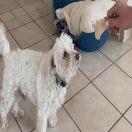
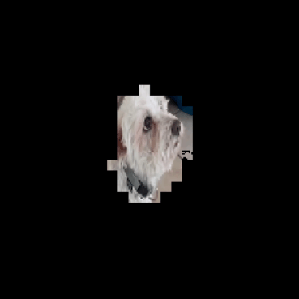

# Fair and Efficient Alternatives to Shapley-based Attribution Methods

Requires Pytorch >= 1.5

* [Usage](#usage-with-scikit) with scikit models
* [Usage](#usage-for-nlp-with-transformers) for NLP classification tasks
* [Usage](#usage-for-vision) for CV classification tasks
* [ECML-PKDD 2022 Experiments](#ecml-pkdd-2022-experiments)

 

## Usage with scikit
Relies on the .score(...) function to compute the metric (accuracy/R²)
```python
from sklearn.linear_model import LogisticRegression
from attribution_models.attribution_scikit import *
from sklearn.preprocessing import StandardScaler

from sklearn.datasets import load_iris

seed = 123
baseline = 0 # Baseline value
retrain = False # Retrain model each round

# Get some data
data = load_iris()
X, y = data.data, data.target
X = StandardScaler().fit_transform(X)

# Model
model = LogisticRegression(random_state=seed)
model.fit(X, y)

# Attribution model
attr_model = FESPForScikit(model, retrain=retrain, baseline=baseline)
attr_scores = attr_model.fit(X, y)

```

## Usage for NLP with Transformers
For ease of use, some functionalities (whole word masking) that depend on the tokenizer are disabled.

```python
from transformers import RobertaTokenizerFast, RobertaForSequenceClassification
from attribution_models.attribution_nlp import *

# Load tokenizer and model
tokenizer = RobertaTokenizerFast.from_pretrained("textattack/roberta-base-imdb")
model = RobertaForSequenceClassification.from_pretrained("textattack/roberta-base-imdb")

# Set kernel and stride for the window and other params
device = "cuda"
kernel = 1
stride = 1
batch_size = 16

# (optional) Set a post processing function (on prediction):
post_processing = lambda x: torch.softmax(x, dim=-1)

# List of sentences to process
sentences = [
    "I did not enjoy this film which was very bad.", 
    "This movie was good but kind of boring at some point."
    ]

# Load attribution model
attr_model = FESPWithTransformers( # or ESWithTransformers(...)
    model=model, 
    tokenizer=tokenizer, 
    batch_size=batch_size, # default 16
    post_processing=post_processing, # None for default
    device=device # default "cuda"
    ) 

# Fit to return scores and labels, special tokens are not masked
scores, labels = attr_model.fit(sentences, kernel, stride)
scores, labels
```
Output:
```
([[('<s>', 0.0),
   ('I', 0.15438802540302277),
   ('Ġdid', 0.15713782608509064),
   ('Ġnot', 0.2405756264925003),
   ('Ġenjoy', -0.17447549104690552),
   ('Ġthis', -0.015261843800544739),
   ('Ġfilm', 0.13654541969299316),
   ('Ġwhich', -0.07456766068935394),
   ('Ġwas', -0.002198144793510437),
   ('Ġvery', -0.1329994797706604),
   ('Ġbad', 0.5590358376502991),
   ('.', -0.0034263581037521362),
   ('</s>', 0.0)],
  [('<s>', 0.0),
   ('This', -0.0057964324951171875),
   ('Ġmovie', -0.21111544966697693),
   ('Ġwas', 0.1423962116241455),
   ('Ġgood', 0.4381908178329468),
   ('Ġbut', 0.1709291934967041),
   ('Ġkind', 0.12889578938484192),
   ('Ġof', 0.09661826491355896),
   ('Ġboring', -0.21711698174476624),
   ('Ġat', 0.19199597835540771),
   ('Ġsome', -0.16731815040111542),
   ('Ġpoint', 0.12391430139541626),
   ('.', 0.1621803343296051),
   ('</s>', 0.0)]],
 [0, 1])
```


## Usage for vision
Similar to occlusion models, ES and FESP can have some sensibility to hyperparameters. Thus it is recommended to mix different attribution methods to improve overall quality, see: 
* SHAP: https://github.com/slundberg/shap
* Captum: https://github.com/pytorch/captum


```python
from attribution_models.attribution_vision import *
from torchvision import models

# Load a pretrained model
model = models.vgg16(pretrained=True)


# Set class params
device = "cuda"
noise_distribution = (0, 0) # Will draw from normal distribution (mean, std)
batch_size = 64

# Fit params
block_size = (56, 56) # Window
stride = 8
circular = False # Access pixels from the other side

# (optional) Set a post processing function (on prediction):
post_processing = lambda x: torch.softmax(x, dim=-1)

# inputs: (batch, channel, height, width)
inputs = torch.randn(2, 3, 224, 224)

# Load attribution model
attr_model = FESPForVision( # or ESForvision(...)
    model=model, 
    noise_distribution=noise_distribution, 
    batch_size=batch_size, 
    post_processing=post_processing, 
    device=device
    )

# Get attribution map and labels
scores, labels = attr_model.fit(
    inputs, 
    block_size=block_size, 
    stride=stride, 
    circular=circular
    )

# Get top% pixels binary mask
top = 0.10
top_k_pixels_mask = attr_model.get_top_scores(scores, top=top)

scores.shape, top_k_pixels_mask.shape, labels.shape

```
Output:
```
torch.Size([2, 1, 224, 224]) torch.Size([2, 1, 224, 224]) torch.Size([2])
```


## ECML-PKDD 2022 Experiments
Running the experiments requires [SHAP](https://github.com/slundberg/shap) and [Captum](https://github.com/pytorch/captum) to compute shapexplainer and deepexplainer: 
```
pip install shap 
pip install captum 
pip install tqdm scipy imageio
```

### For vision
```
cd exp_vision 
```
To get the dataset:
```
bash get_dataset.sh
```
To run eval on one or more models, edit run_eval.sh and change the config.
Can take some time to run (GPU required), output is saved in exp_vision/tmp:
```
bash run_eval.sh
```
To plot accuracy:
```
python gen_plot.py --path tmp/ --name output.png
```

### For NLP
```
cd exp_nlp 
```
To run eval on one or more models, edit run_eval.sh and change the config.
Can take some time to run (GPU required), output is saved in exp_nlp/tmp:
```
bash run_eval.sh
```
To plot accuracy:
```
python gen_plot.py --path tmp/ --name output.png
